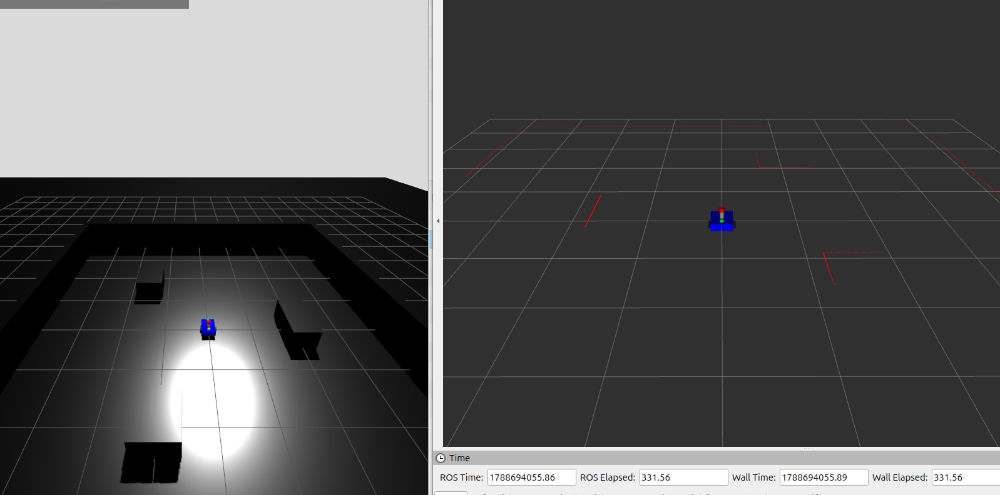
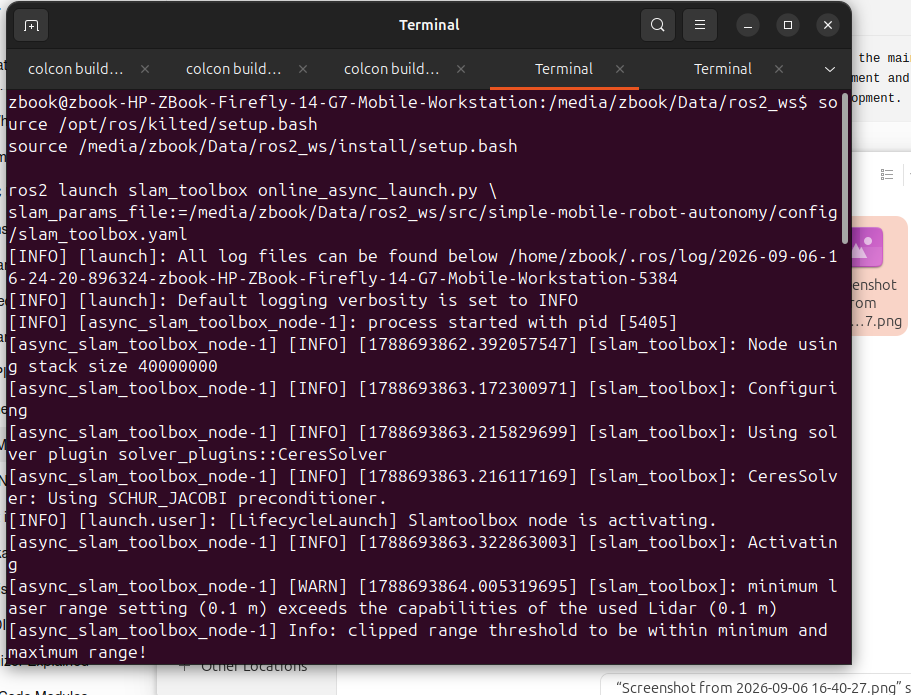
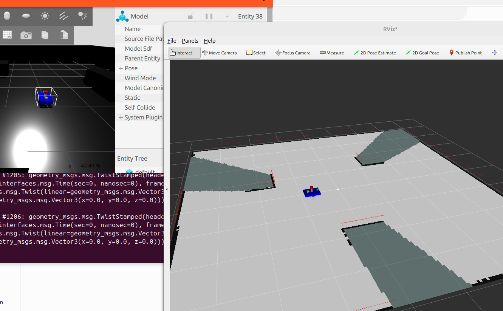
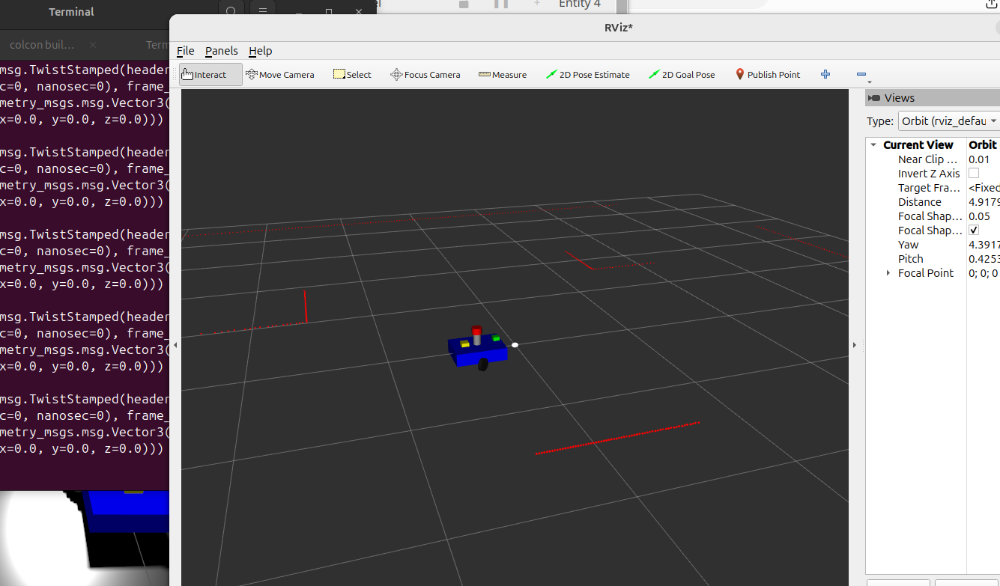
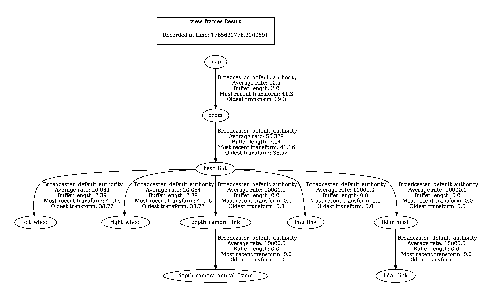
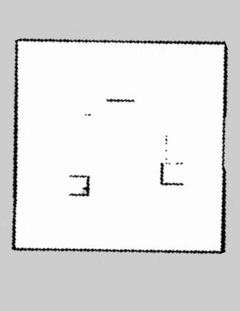

# Simple Mobile Robot Autonomy

This project presents a ROS 2-based mobile robot simulation developed for learning and implementing basic autonomous robotics concepts. The project builds upon a differential-drive mobile robot by integrating robot control, sensor simulation, TF transformations, odometry, LiDAR-based perception, and 2D SLAM mapping.

The robot is simulated in Gazebo and equipped with a LiDAR, IMU, and depth camera. SLAM Toolbox is used to process LiDAR and odometry data to generate a 2D map of the simulated environment, while RViz2 is used for visualization and monitoring of the robot, sensor data, TF frames, and generated map.

## Robot Structure

base_link

├── left_wheel

├── right_wheel

├── depth_camera_link
│   └── depth_camera_optical_frame

├── imu_link

└── lidar_mast
    └── lidar_link

## Features

URDF/Xacro-based robot description
Differential drive configuration
ros2_control integration
diff_drive_controller integration
Wheel odometry
LiDAR sensor integration
IMU sensor integration
Depth camera integration
TF2 frame transformations
Gazebo simulation
SLAM Toolbox integration
2D SLAM mapping
RViz2 visualization
Occupancy-grid map generation
Saving the final SLAM map

## Gazebo Simulation

  

The robot is simulated in a custom indoor Gazebo environment containing multiple obstacles and structures. The environment is used to test LiDAR perception and 2D SLAM mapping.

## SLAM Toolbox

  

SLAM Toolbox is used to generate a 2D map using LiDAR measurements, wheel odometry, and TF transformations.

The SLAM system is launched using:

ros2 launch slam_toolbox online_async_launch.py \
slam_params_file:=/media/zbook/Data/ros2_ws/src/simple-mobile-robot-autonomy/config/slam_toolbox.yaml

## SLAM Mapping

  

The robot explores the simulated environment while SLAM Toolbox continuously processes the LiDAR data and builds an occupancy-grid map.

## RViz2 Visualization

  

RViz2 is used to visualize the robot model, generated map, LiDAR data, TF frames, and other ROS 2 information during the mapping process.

## TF Frame Structure

  

The TF2 tree establishes the relationship between the map, odometry, robot base, wheels, and sensors.

map
└── odom
    └── base_link
        ├── left_wheel
        ├── right_wheel
        ├── depth_camera_link
        │   └── depth_camera_optical_frame
        ├── imu_link
        └── lidar_mast
            └── lidar_link

## Final SLAM Map

  

The final occupancy-grid map generated using SLAM Toolbox is saved for use in future localization and autonomous navigation stages.

## Tools Used

ROS 2 Kilted Kaiju
Gazebo Sim
URDF / Xacro
ros2_control
diff_drive_controller
SLAM Toolbox
RViz2
TF2

## Project Status

Robot modeling — Completed
Gazebo simulation — Completed
Differential-drive control — Completed
Sensor integration — Completed
TF and odometry — Completed
SLAM Toolbox integration — Completed
2D SLAM mapping — Completed
Final map generation — Completed
Autonomous localization — Future Work
Nav2 navigation — Future Work

## Future Work

Implement map-based localization
Integrate Nav2
Add global and local costmaps
Implement autonomous path planning
Implement obstacle avoidance
Add autonomous goal navigation
Perform sensor fusion using LiDAR, IMU, and odometry
Deploy the autonomy stack on the physical robot
